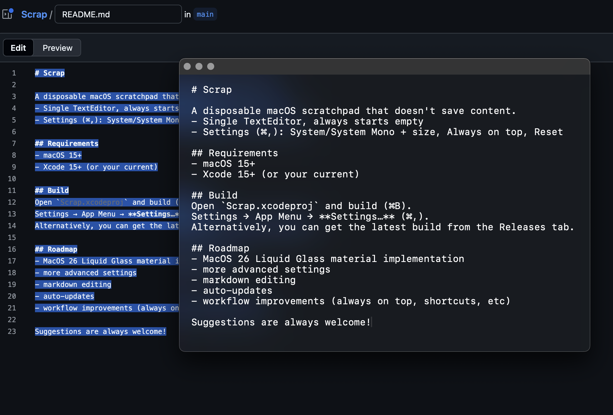

# Scrap

A disposable macOS scratchpad that doesn't save content.  
- Single TextEditor, always starts empty  
- Settings (⌘,): font, size, and more settings

## Requirements
- macOS 15+
- Xcode 15+ (or your current)

## Build
Open `Scrap.xcodeproj` and build (⌘B).  
Settings → App Menu → **Settings…** (⌘,).
Alternatively, you can get the latest build from the Releases tab.

## Roadmap
- MacOS 26 Liquid Glass material implementation

Suggestions are always welcome!

  

todo: new screenshot
